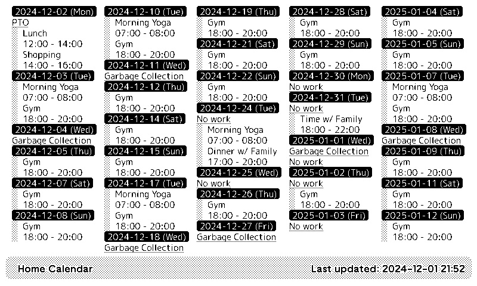
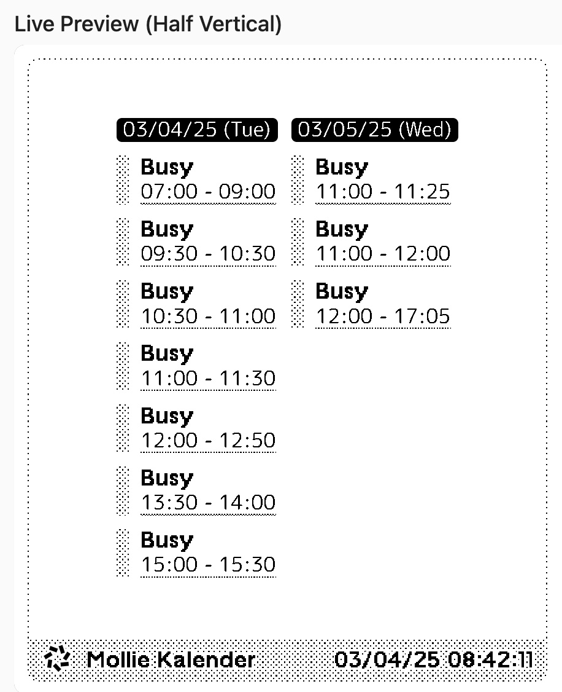
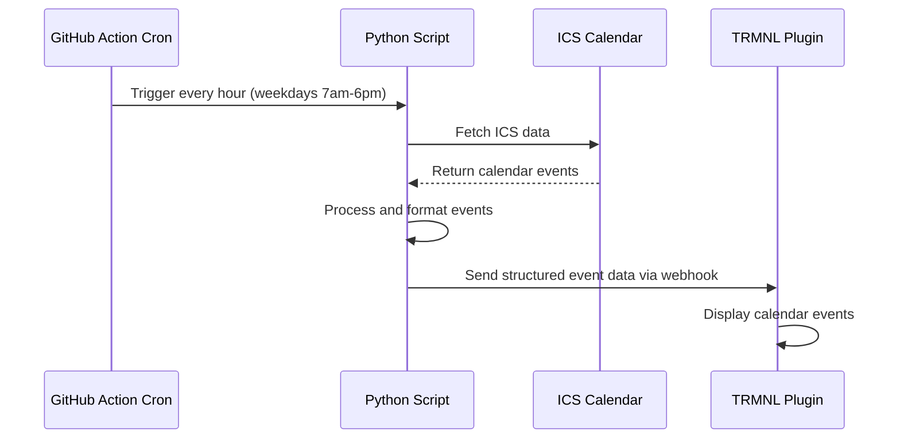

# Calendar plugin for TRMNL

A TRMNL plugin that fetches an ICS calendar and display events in a multi-column list format.



## What This Fork Does Differently

My company doesn't allow random OAuth apps access to our Google calendars. So I had to publish a redacted version as .ics and use this TRMNL plugin for showing at least basic calendar info on my TRMNL. This way, my family can at least see when I'm busy and when it's safe to enter my work room.

I refined the template.html so it looks better when viewed in a vertical split on TRMNL. Also, this repo holds a Github Action that runs on a cron. The calendar is synced to TRMNL every hour from 7am to 6pm on weekdays. This way, my work calendar stays synced up when it needs to.



## Data Flow Diagram



## Setup

1. At TRMNL, add a new Private Plugin
2. Choose strategy "Webhook", save the Plugin and copy "Webhook URL"
3. Click "Edit Markup" and populate it with the content of `template.html` file in this directory
4. Create `.env` file in this directory with the following content. Edit configuration as needed.

```
TRMNL_TITLE="<title to display in title bar>"
TRMNL_WEBHOOK_URL=<your Webhook URL>
TRMNL_ICS_URL=<your calendar ICS url(s) seperated by a comma (,)>
TRMNL_DAYS=30 # number of days to display
TRMNL_TZ="<your timezone>" # example: America/Los_Angeles
TRMNL_NUMBER_COLUMNS=5
#TRMNL_DATE_FORMAT="%x (%a)" # example:"%Y-%m-%d (%a)"
#TRMNL_TIME_FORMAT="%H:%M"
#TRMNL_UPDATED_AT_FORMAT="%x %X"
#TRMNL_LOCALE="en_US.UTF-8"
```

5. Run `main.py`
